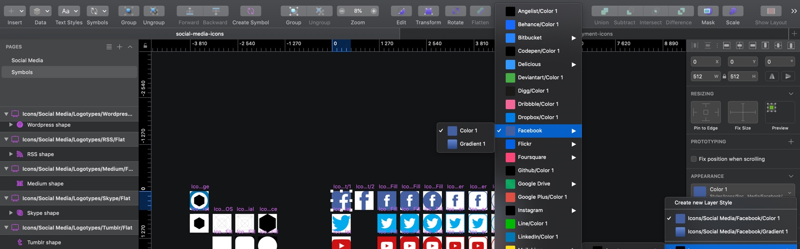

# Social Media Icons as a SketchApp Library
A [SketchApp](https://www.sketch.com/) library with all the graphical assets for social media outlets.
The library is built so you as a SketchApp user, graphical designer &/or UX/UI designer easily can extend your ongoing graphical work with the power of having centralization in your modifications and changes. Also, so we as a community can use the power of open-source, for instance if a social media vendor changes brand colors, logo symbols etc. help each other to change it easily.

---

## Table of contents
* [File formats](#file-formats)
* [Social Media](#social-media)
* [Symbol Structure](#symbol-structure)
* [Shared styles structure](#shared-styles-structure)
* [What's new](#whats-new)
* [Future improvements](#future-improvements)
* [Versioning](#versioning)
* [Creators](#creators)
* [Special thanks to](#special-thanks-to)
* [Copyright and license](#copyright-and-license)
* [Disclaimer](#disclaimer)

---

### File formats
Following file formats are included within this template:
* Sketch file (.sketch)
* Images for documentation (.jpg)

---

### Social media
Following social media icons that are included within this Sketch library:

* [Facebook](https://www.facebook.com/)
* [Twitter](https://twitter.com/)
* [Instagram](https://www.instagram.com/)
* [LinkedIn](https://www.linkedin.com/)
* [Pinterest](https://www.pinterest.com/)
* [Tumblr](https://www.tumblr.com/)
* [Skype](https://www.skype.com/)
* [RSS](https://en.wikipedia.org/wiki/RSS)
* [Wordpress](https://wordpress.com/)
* [Github](https://github.com/)
* [Vimeo](https://vimeo.com/)
* [Delicious](https://del.icio.us/)
* [Digg](http://digg.com/)
* [Quora](https://www.quora.com/)
* [Mailchimp](https://mailchimp.com/)
* [Dribbble](https://dribbble.com/)
* [Behance](https://www.behance.net/)
* [Yelp](https://www.yelp.com/)
* [Reddit](https://reddit.com/)
* [Flickr](https://www.flickr.com/)
* [VK](https://vk.com/)
* [Stumbleupon](https://www.stumbleupon.com/)
* [Foursquare](https://foursquare.com/)
* [Tripadvisor](https://www.tripadvisor.com/)
* [AngelList](https://angel.co/)
* [Dropbox](https://www.dropbox.com/)
* [Google Drive](https://www.google.com/drive/)
* [Codepen](https://codepen.io/)
* [Stackoverflow](https://stackoverflow.com/)
* [Snapchat](https://www.snapchat.com/)
* [Google+](https://plus.google.com/)
* [Trello](https://trello.com/)
* [OK](https://ok.ru/)
* [WhatsApp](https://www.whatsapp.com/)
* [WeChat](https://www.wechat.com/)
* [Viber](https://www.viber.com/)
* [Xing](https://www.xing.com/)
* [DeviantArt](https://www.deviantart.com/)
* [Meetup](https://www.meetup.com/)
* [Slack](https://slack.com/)
* [Telegram](https://telegram.org/)
* [Messenger](https://www.messenger.com/)
* [Line](https://line.me/)
* [TikTok](https://www.tiktok.com/)
* [Bitbucket](https://bitbucket.org/)
* [Soundcloud](https://soundcloud.com/)
* [Spotify](https://www.spotify.com/)

---

## Structure of document

### Symbols
For further and more detailed information about the structure of the symbols, please look at the attached picture below.

```
Symbols/
└── Icons/
    ├── Assets
    │   ├── App/    
    │   ├── Foreground/
    │   └── Background/
    └── Social Media
        ├── Icons/  
        │    ├── Oval
        │    │    ├── Border
        │    │    └── Fill
        │    ├── Rounded
        │    │    ├── Border
        │    │    └── Fill
        │    └── Square
        │         ├── Border
        │         └── Fill
        └── Logotype/
             └── {{socialMediaName}}
                  ├── Orginal
                  └── Flat
                      ├── 1
                      └── 2
```


### Shared styles
For further and more detailed information about the structure of the shared styles, please look at the attached picture below.

```
Shared styles/
├── Assets/
│   ├── Black
│   ├── White
│   └── Grid
└── Icons
    └── Social Media
        └── {{socialMediaName}}
             ├── Color 1
             ├── Color 2
             ├── Color 3
             ├── Gradient 1
             └── Gradient 2
```



---

## What's new

* Included original logotypes (the one's I've could find)
* Every logotype and icon is made into a symbol
* Symbol Structure within Sketch for easier access
* Brand colors (as shared styles)
* All shared styles have a structure
* Flat logotypes
* Documentation
* Copyright and license
* Disclaimer

## Future improvements

* Update some of the logotypes
* Make optimizations to the whole framework
* Make it more lightweight so it runs smoother
* Make 3D versions/gradients

## Versioning
For transparency into our release cycle and in striving to maintain backward compatibility, this library is maintained under the Semantic Versioning guidelines. Sometimes we screw up, but we adhere to those rules whenever possible.

See the Releases section of our GitHub project for changelogs for each release version of this library.

---

## Creator(s)

**Jonas Bröms**
* [Twitter](https://twitter.com/jonasbroms)
* [GitHub](https://github.com/bromso)
* [Facebook](https://www.facebook.com/jonas.broms)

## Special thanks to:
* [SketchApp Plugin SketchRunner](http://sketchrunner.com/)
* [SketchApp Plugin RenameIt](https://rodi01.github.io/RenameIt/)
* [SketchApp Plugin Style Master](https://github.com/aparajita/sketch-style-master)
* [SketchApp Plugin Symbol Organizer](https://github.com/sonburn/symbol-organizer)

---

## Copyright and license
Graphical assets, files, code and documentation released under the [MIT](https://). Docs released under [Creative Commons](https://).

## Disclaimer
While we have redrawn and shared these assets for the benefit of the design community, we do not own any of the underlying products, logotype or user interface designs. By accessing these assets, you agree to obtain all necessary permissions from the underlying rights holders and/or adhere to any applicable brand use guidelines before using them. We disclaims all express or implied warranties with respect to these assets, including non-infringement of intellectual property rights.
